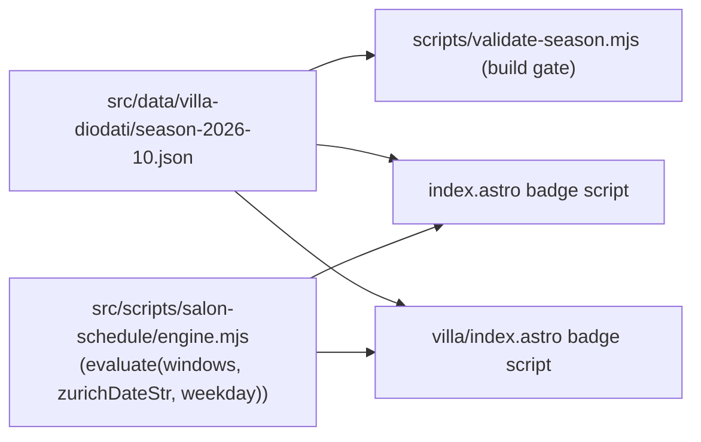

# Design: salon-weekend-schedule

## Overview

Committed season JSON + a tiny pure state engine + vanilla badge wiring on the two public surfaces. State is computed at view time by comparing the **Europe/Zurich calendar date string** (via `Intl.DateTimeFormat` with `timeZone`) against window date strings — no timestamp offset arithmetic, no network. Requirement id map: R1 = Season data, R2 = State engine, R3 = Badges, R4 = Honest failure, R5 = Lightweight integration.

## Architecture

- Zurich "today" is derived with `new Intl.DateTimeFormat('en-CA', { timeZone: 'Europe/Zurich' })` → `YYYY-MM-DD`, and the same formatter gives the weekday name. These strings drive every branch (R2, DST-safe by construction; falls are handled by the formatter, and window Oct 30 spans the CET boundary).

## Components and interfaces

### src/data/villa-diodati/season-2026-10.json (R1)

- Shape: `{ "season": "October 2026", "timezone": "Europe/Zurich", "replayDayMapping": { "Friday": "day-1", "Saturday": "day-2", "Sunday": "day-3" }, "windows": [ { "id": "w1", "start": "2026-10-02", "end": "2026-10-04" }, … w5 end "2026-11-01" ] }`
- Future seasons: add a file and update the two importing pages (single-line data import); no engine change.

### src/scripts/salon-schedule/engine.mjs (R2)

- `export function evaluate(windows, playDayMap, nowInfo)` where `nowInfo = { zurichDate: 'YYYY-MM-DD', weekday: 'Friday' }`; pure, no DOM.
- Returns `{ state: 'upcoming'|'playing'|'archived', windowId?: string, replayDayId?: 'day-1'|'day-2'|'day-3', nextWindowStartDate?: string }`.
- Logic: window contains zurichDate (inclusive) → `playing` (with weekday→day mapping; if the weekday is outside Fri–Sun inside the window — impossible given the window shape, but guarded — map to `null` and label "Playing"); else next window start > today → `upcoming` with that start; else `archived`.

### scripts/validate-season.mjs (R4)

- Reads the season JSON; asserts 5 windows, ISO date parse, strictly ascending, no overlap, mapping keys exactly Friday/Saturday/Sunday. Called from the `build` chain: `astro build && node scripts/validate-season.mjs && node scripts/sw-version.mjs && node scripts/copy-404.mjs`. Fails the build on violation.

### Badge integration (R3, R5)

- `src/pages/index.astro`: featured card gets `` with a default static label "October Fri–Sun season" (no-JS fallback); a single `<script>` (Astro-bundled module, no framework) imports engine + season JSON and sets badge text/`data-plays` attr.
- `src/pages/villa/index.astro`: same pattern on the `.villa-kicker` row; badge shows "Playing now · Day 2" (mapped day) / "Opens Fri 10/9" / "Season closed".
- Badge text rules (single source in engine consumers): 
  - `playing` → `Playing now · ${dayLabel}` where dayLabel = `Day N` from mapping id order; 
  - `upcoming` → `Opens Fri ${M}/${D}`; 
  - `archived` → `Season closed`.
- No runtime fetches; JSON is bundled/imported (R5).

## Error handling

- Build-time validation is the failure surface (R4) — pages never render invented states.
- Browser Intl edge cases: engine consumers wrap consumer code in try/catch and leave the static default label on unexpected errors (badge is cosmetic).

## Testing strategy

- Unit (node): `evaluate` at synthetic instants — before w1; inside each of the five windows on Fri/Sat/Sun; Oct 25 (DST-end day) and Oct 30 (CET boundary day); between w3 and w4; after w5. Assert states, mappings, next-start. Pure function → easy table tests.
- Build: `npm run build` green (R1, R4 validation ran).
- Preview manual: badges present on `/` and `/villa/`; compute-time check via evaluating `evaluate` with current real data; confirm `data-plays` attributes set; confirm zero network requests from badge code paths (DevTools) — `/villa/` remains fetch-free (R5).

## Risks and trade-offs

- Client-clock tampering shows a wrong badge for that user only — accepted (badge is cosmetic; member gating re-evaluates state server-side later).
- `Intl` coverage assumed (universal in all browsers since 2017).
- Rejected: build-time baking of state (would go stale for windows 2–5) and cron-rendered text (GitHub Pages has no hooks).

## Traceability recap

- R1 → season JSON + validate script
- R2 → engine.mjs + badge scripts
- R3 → badges on index + villa
- R4 → validate-season.mjs in build
- R5 → module-only bundle, no fetches
