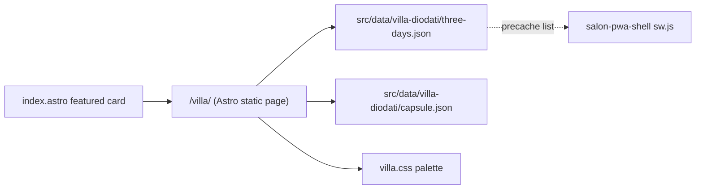

# Design: villa-3day-replay

## Overview

Serve the Villa Diodati three-day conversation as a statically rendered Astro page at `/villa/`, fed by vendored JSON data committed to the salon repo. Zero client framework on this route: the day/scene interactivity is plain HTML `
` disclosure elements. Requirement id map (per requirements.md heading order): R1 = Static public replay, R2 = Three-day structure & navigation, R3 = Mobile-first presentation, R4 = Offline readiness, R5 = Lightweight public path.

## Architecture

- The page is built at deploy time by Astro on GitHub Actions; browsers receive pure HTML/CSS (R5, R1).
- Data is vendored once from `CastaliaInstitute/castalia.institute/villa-diodati/{agenda.json,journal-capsule.json}` into curated, minified repo-local JSON so the salon repo never fetches at runtime (R1). The vendoring is a manual `scripts/vendor-villa-data.mjs` run against a sibling checkout; output is committed (no CI dependency on the private repo).
- `/villa/` renders all three days on one page with `#day-1|2|3` anchors and a sticky compact day nav; scenes are `
` elements (R2).

## Components and interfaces

### src/pages/villa/index.astro

- Responsibility: render Day 1–3 sections from vendored data; each scene is a timed `
` card (summary row: 1816 time, scene title, participants; body: scene prose, mood line, character chips, participants' journal notes and quotes).
- Interface: depends on `BaseLayout`; exports nothing (static).
- Serves: R1, R2, R3, R4.

### src/data/villa-diodati/three-days.json

- Responsibility: canonical static content. Shape: `{ meta: {location, dateRange, framing: 'Fri–Sun'}, days: [ { id: 'day-1', historicDate: '1816-06-15', weekday: 'Friday', scenes: [ { time: '09:00', title: string, text: string, mood: string, characters: string[] } ] } ] }`.
- Interface: consumed by `src/pages/villa/index.astro` (import at build). Schema validated by the vendoring script before commit.
- Serves: R2, R4.

### src/data/villa-diodati/capsule.json

- Responsibility: per-persona `{ name, voiceTone, themes, motifs, quotes, journalNotes }` distilled from `journal-capsule.json`.
- Interface: imported by the page; keyed lookup by character display name.
- Serves: R2, R3.

### src/styles/villa.css

- Responsibility: villa dark palette tokens (warm umber `#1e1a16` family consistent with index `.villa-theme`), scene card styling; `summary { min-height: 48px; }`, fluid type, `max-width: 70ch` reading measure.
- Serves: R3.

### src/pages/index.astro (edit)

- Responsibility: featured card now links to `/villa/` (first) while retaining "Open the simulation" link to the main site for members (R2, R4 context; card copied verbatim otherwise).

## Data models

- `three-days.json` derived from `agenda.json` scenes (`datetime` → `time` + `weekday` via Europe/Zurich calendar), scene text seeded from `scene`+`notes` and capsule quotes; title = first clause of scene. Vendoring script asserts: 3 days, day 1 starts 1816-06-15, every scene has non-empty text and a character list.
- No runtime data mutation; the JSON is the contract.

## Error handling

- Static render: failures surface at build time in CI (missing/invalid vendored data fails `npm run build`), never at runtime.
- `scriptorium` of vendoring: if sibling castalia.institute checkout is absent, the script exits with instructions instead of writing partial data.

## Testing strategy

- Build-time: `npm run build` (Astro) proves data + page render; vendoring script asserts schema.
- Static analysis: `npm run check` (Astro/TS).
- Manual/DevTools on `npm run preview`: 320px and 430px viewports (no horizontal scroll), tap targets ≥44px, day nav + scene disclosure behavior.
- Offline: after `salon-pwa-shell` lands, loads from SW cache (covered in shell + launch spec verification).

## Risks and trade-offs

- Single-page (all 3 days) vs per-day routes: chose single page + anchors for zero routing complexity and simpler precache; cost is a slightly longer page, mitigated by `
` collapsed scenes.
- Keeping `
` instead of a JS accordion: native, accessible, zero-JS; acceptable visual control via CSS marker styling.
- Open question for tasks: final icon/typography accent for scene headers (pursued by whoever implements; palette fixed).
