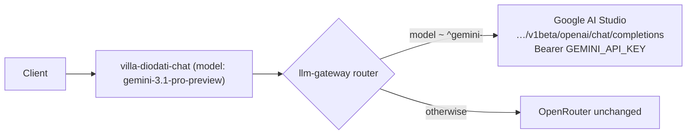

# Design: villa-chat-gemini

## Overview

Introduce a provider router inside `llm-gateway`: requests whose model id starts with `gemini-` route to Google AI Studio's OpenAI-compatible endpoint (`https://generativelanguage.googleapis.com/v1beta/openai/chat/completions`) reading `GEMINI_API_KEY` from edge secrets; everything else keeps the existing OpenRouter behavior so other institute consumers are untouched. `villa-diodati-chat` switches its model id to `gemini-3.1-pro-preview`. Requirement id map: R1 = Gemini provider routing, R2 = OpenAI-compatible surface, R3 = OpenRouter retirement for the salon, R4 = Server-side key only, R5 = Failure transparency, R6 = Prompt behavior preserved.

## Architecture

- Routing is model-prefix based, not path based, so the shared gateway keeps one OpenAI-compatible surface (R2) and other consumers never see a behavior change (R1 default-toggle is handled by `LLM_GATEWAY_DEFAULT_PROVIDER=gemini` env, off by default).
- Streaming preserves the current pass-through contract: the request body is forwarded with `stream: true|false` as received; Gemini's OpenAI-compat endpoint returns SSE for `stream: true`.

## Components and interfaces

### supabase/functions/llm-gateway/index.ts

- Responsibility: resolve upstream by model id + execute call with correct auth header; map errors to OpenAI-compat shape.
- Interface (new internal fns):
  - `resolveUpstream(model): { kind: 'google' | 'openrouter'; url; token; }` — `kind: 'google'` iff `model.startsWith('gemini-')`; token = `Deno.env.get('GEMINI_API_KEY')`; url = `https://generativelanguage.googleapis.com/v1beta/openai/chat/completions`.
  - Google executor reuses the existing forward-subset (`temperature`, `top_p`, `stop`, `max_tokens`, …) and maps Gemini models' known-reasonable fields directly (OpenAI-compat endpoint accepts the same chat body).
- Interface (changed):
  - Key check: the current "no OpenRouter key available → 500" preflight becomes "no key available for the resolved provider" (Google path fails with a Google-named error when `GEMINI_API_KEY` unset; OpenRouter path unchanged).
  - If `LLM_GATEWAY_DEFAULT_PROVIDER=gemini`, modelless requests default to `gemini-3.1-pro-preview`; otherwise `openai/gpt-oss-120b` as today.
- Serves: R1, R2, R3, R4, R5.

### supabase/functions/villa-diodati-chat/index.ts

- Responsibility: unchanged orchestration; single-line change of requested model id `openai/gpt-oss-120b:free` → `gemini-3.1-pro-preview` (persona prompts, temperature 0.92, max_tokens 500, 8-turn truncation untouched).
- Serves: R1, R3, R6.

### Deployment (supabase CLI)

- Responsibilities: `supabase functions deploy llm-gateway, villa-diodati-chat` (project `xougqdomkoisrxdnagcj`) and `supabase secrets set GEMINI_API_KEY=<key>`; verify via hosted URL probes.
- Serves: R4, R5 verification.

## Data models

- No schema/migration changes; chat history stays client/room-owned as today (last-8-turn slice computed in `villa-diodati-chat`).
- Request bodies on the Google path accept the same forwarded subset — no field translation needed.

## Error handling

- Upstream non-2xx from Google: if the response is OpenAI-compat-shaped JSON, pass through with an added `provider: 'google-ai-studio'` field; else wrap as `openAICompatError('Gemini API error <status>', <status>)`. Never echo request headers/key material (R5).
- Missing `GEMINI_API_KEY`: `openAICompatError('Google AI Studio key not configured (GEMINI_API_KEY)', 500)` — same JSON shape the current keyless path returns, so client messaging logic needs no change.
- Latency: conversation passes through the existing 30s client timeout; no new retry loops added in v1 (R5).

## Testing strategy

- Unit: local `deno test` for `resolveUpstream(model)` prefix routing + default-provider toggle (uses env fakes; both source sets already run under `tests/diodati-salon-gym.test.ts` pattern where applicable).
- Integration/hosted: scripted curl against the hosted `llm-gateway` and `villa-diodati-chat` (anon key from the main repo's env) asserting: (a) each persona returns a first-person reply, (b) `modelVersion`/error bodies identify Google on failure, (c) no `openrouter.ai` hosts in request logs during the run (R3).
- E2E with the app: main-site `/salon/villa.diodati/` page chat uses the same functions; manual check equals the salon member flow used later by `member-salon-entry`.

## Risks and trade-offs

- Prefix-routing vs param-based selecting: prefix keeps every existing caller binary-compatible; a `provider` body param was rejected because it would silently change SDK typing.
- Keeping OpenRouter branch: honors the shared-gateway contract; full retirement of OpenRouter across the institute is explicitly out of scope (requirements Non-goals) — salon-only retirement (R3).
- Key-service fallback asymmetry: Google path has no rotation fallback; acceptable because Google AI Studio credits are quota-based, and a hard, honest error beats silent provider hopping (R5).
- Preview model future risk: `gemini-3.1-pro-preview` is Preview with no shutdown date announced; tasks add the model id to `LLM_GATEWAY_MODELS` env and a README note so a future id bump is a one-line change.

## Traceability recap (R# ↔ components)

- R1 → `resolveUpstream`, `villa-diodati-chat` model id, default-toggle
- R2 → Google path reuses gateway surface/contract
- R3 → salon route zero OpenRouter calls
- R4 → secrets-only key via Supabase
- R5 → error mapping + honest failure
- R6 → orchestration unchanged
